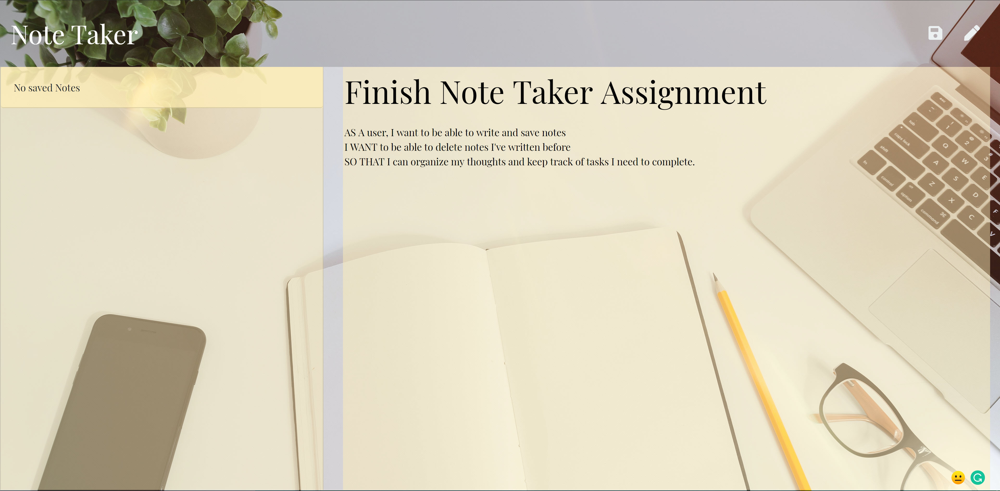
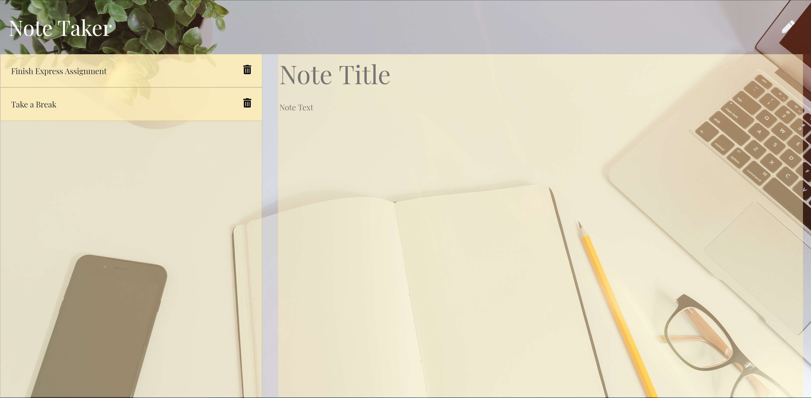

# MBC-Note-Taker

## Application & Repository Link

###### [Application Link](https://thawing-tundra-80064.herokuapp.com/)

###### [Repository Link](https://github.com/Suji-GitH/MBC-Note-Taker)

## Content
- [Overview](#Overview)
- [Acceptance Criteria](#Acceptance-Criteria)
- [Application Screens](#Application-Screens)
- [Credits](#Credits)
- [Testing](#Testing)

## Overview

```
AS A user, I want to be able to write and save notes
I WANT to be able to delete notes I've written before
SO THAT I can organize my thoughts and keep track of tasks I need to complete
```

## Acceptance Criteria

* Application should allow users to create and save notes.
* Application should allow users to view previously saved notes.
* Application should allow users to delete previously saved notes.

## Application-Screens

###### App Screenshots

Landing Page
- Click "Get Started" to begin. 


Notes Page
- Type in title and content in the allocated areas and click the save icon on top right. 


Saved Note
- Saved items are displayed on the left panel.


Delete Note
- Click on the trash can icon to remove note. 


## Credits

- Monash Bootcamp for content included in the public folder
- npm express
- node.js
- Bootstrap

## Testing

```
Given the pencil icon button is clicked, text areas will be editable by clicking inside the title and text areas.
Given that user has inputted text description and title text, Save button appears.
Given that when user clicks on the save button with correct input, the user input is saved on the left side bar. 
Given that user selects a note from the side bar, it is displayed on the right hand side panel.
```
